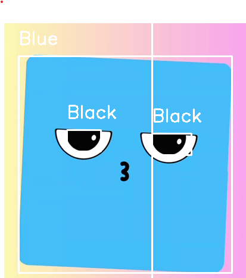

# Color Detection with OpenCV 

This is my first project using Computer Vision and OpenCV.  
It detects some colors (like green, blue, black, pink, and orange) in a video and shows a box around them with the color name.

# What the Project Does

- Opens a video.
-  Looks for specific colors using the HSV color range
- Draws a rectangle around each color found.
- Writes the name of the color on top of it.

# Example Output

